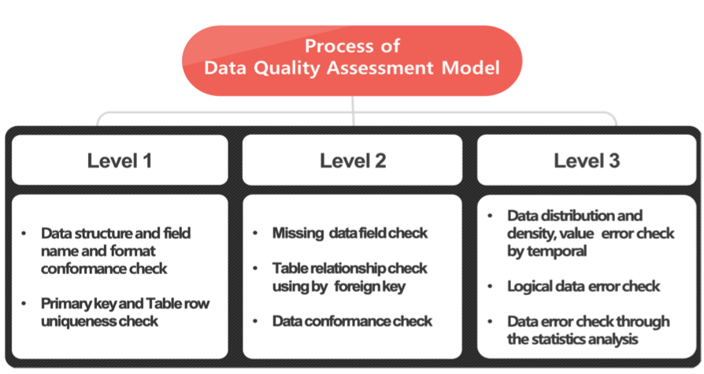
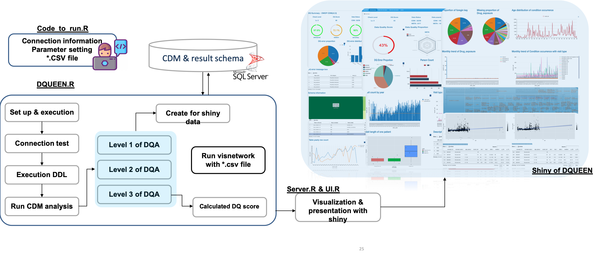
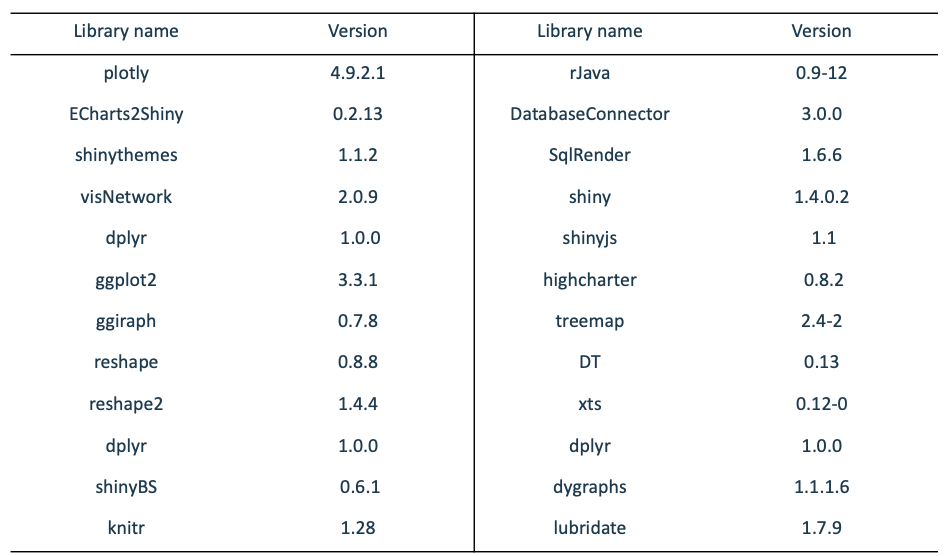

DQUEEN v 0.5 
(Data QUality assEssmENt and managing tool) 
====================
The goal of the DQUEEN project is to design and develop an open-source tool to expose and evaluate OMOP-CDM and meta data. 
Also,DQUEEN help to easily understand about Data Quaity information. 
(This version only support DQA of OMOP-CDM)

[](https://youtu.be/SYtHd1mWMCE)

Introduction  
====================
This package will run a series of data quality checks against an OMOP CDM instance (currently supports v5.3.1).
DQUEEN support of 7 Data Quality concept evaluation and providing 3 level of Data Quality Assessment 
Aim of initial DQA level like below 

DQA level 1. 
- level 1 aims to find out whether the subj ect data for assessment corresponds with previous definition and whet her there is duplication between primary key and entire row.
- DQA Concept: OMOP-CDM conformance, Uniqueness check 

DQA level 2. 
- Level 2 evaluates the ratio of missing values to foreign keys in the data and t he suitability of the data.
- DQA Concept: Completeness, Conformance-relation, Conformance-Value 

DQA level 3. 
- Level 3 evaluates the distribution of data in order of date and logical errors. It also performs a statistical analysis to identify the error data.
- DQA concept: Accuracy, Plausibility-Atemporal, Plausiblity-Temporal

If you want more specific information details in [here](introduction.md)

Overview in DQA process of DQUEEN
====================
DQUEEN's system process like below

 1. User entered the input parameter of Data Quality Assessment 
 2. DQUEEN check the connection information and create result tables 
 3. Data quality assessment is performed according to the DQA level entered by the user.
 4. if DQA level 3 then calculated initial Table Data Quality Score with DQ error 
 5. If DQA level 3 then make the Shiny Data 
 6. run shiny App 
 


Data Quality Assessment Target Tables 
====================
- Person
- Death
- Provider 
- Care_site 
- Visit_occurrence 
- Condition_occurrence 
- Drug_exposure 
- Device_exposure 
- Procedrue_occurrence 
- Measurement 

How to use? 
====================
Please make a your own fork of DQUEEN repo 
 1. Excution R studio and open the terminal and input move the directory 
 2. enter the git clone 
  -> input: git clone https://github.com/ABMI/DQUEEN_OMOP_CDM_Version.git (this web address is example)
 3. end of the git clone then move directory of DQUEEN_OMOP_CDM_Version 
 4. open the DQUEEN.Rproj and please build a DQUEEN pacakge (DQUEEN install R packages) 
  -> Click the Build tab and after click Install and Restart
 5. Open the CodeToRun.R (directory like below)
  -> DQUEEN_OMOP_CDM_Version/extras/CodeToRun.R
 6. Enter the DQA Parameter 
  ```r
library(SqlRender)
library(shiny)
library(shinyjs)
library(highcharter)
library(treemap)
library(DT)
library(xts)
library(dplyr)
library(dygraphs)
library(lubridate)
library(plotly)
library(ECharts2Shiny)
library(shinythemes)
library(visNetwork)
library(dplyr)
library(reshape2)
library(dplyr)
library(shinyBS)
library(knitr)
library(ggplot2)
library(ggiraph)
library(reshape)
library(ParallelLogger)

ConnectionDetails <- DatabaseConnector::createConnectionDetails(dbms = "sql server",
                                                                server = "",  #IP
                                                                schema = "master.dbo" ,
                                                                user = "",        #User id
                                                                password = "")

cdmSchema <- 'cdmSchema.dbo' #Target CDM schema name 
metaSchema <- 'metaSchema.dbo' # If you have Meta schema put in your meta schema name 
resultSchema<- 'resultSchema.dbo' # Dqueen result schema name 
level = 3 # DQA level 1 = 1,  DQA level 2 = 2,  DQA level 3 = 3
useRandomExtraction = T # if you want random sampling from CDM shcmea then please put in T or F 
extractioncdmSchema = 'extractioncdmSchema.dbo' # random sampling CDM schema name 
randParameter = 10000 # random smapling person count
etl_stdt = '1995-01-01' #  minimum start date of your CDM
etl_endt = '2015-12-31' #  maximum start date of your CDM
createddl = T #create DDL of DQUEEN result table 
cdmAnalysis = T # run of DQA 
makeShinyData = T # create shiny Data
useVisnetwork=T # if you have csv file of visnetwork you can see ETL flow 
runShiny =T # T: run shiny, F: do not nun Shiny 
visnetworkCsvPath =c(file.path(.libPaths()[1],'DQUEEN','csv','schemas','filename_of_meta.csv'),  # visinetwork file path meta
                     file.path(.libPaths()[1],'DQUEEN','csv','schemas','filename_of_CDM.csv')) # visinetwork file path CDM 
outputFolder = getwd()
verboseMode = T

DQUEEN::dqueen(ConnectionDetails,
               level,
               etl_stdt,
               etl_endt,
               cdmSchema,
               metaSchema,
               resultSchema,
               useRandomExtraction,
               extractioncdmSchema,
               randParameter,
               createddl,
               cdmAnalysis,
               makeShinyData,
               useVisnetwork,
               visnetworkCsvPath,
               runShiny,

)

  ```
If you want more information here is [details](how_to_use.md).

System Requirements
====================
- MSSQL 
- R (version 3.5.2 or higher)
- Install Java SDK (developed in 8 Update 181)
- Install R packages "devtools", "DQUEEN"
- Install Rtools and [set Rtools PATH](https://www.biostat.wisc.edu/~kbroman/Rintro/Rwinpack.html)

More specific R library below here 


Feature 
====================

Technology  
====================
DQUEEN is an Rpackages 

Suupport   
====================
- We use the GitHub issue tracker for all bugs/issues
- Developer questions/comments/feedback: OHDSI Forum or Korean OHDSI Forum

License
====================
DQUEEN is licensed under Apache License 2.0

Development status 
====================
v 0.5 ready for use 

